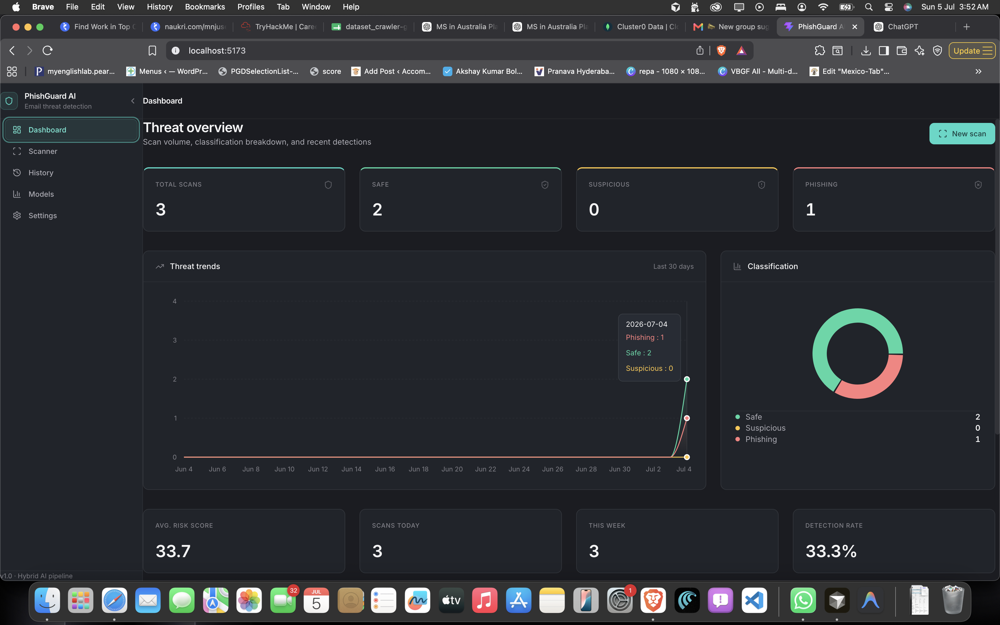
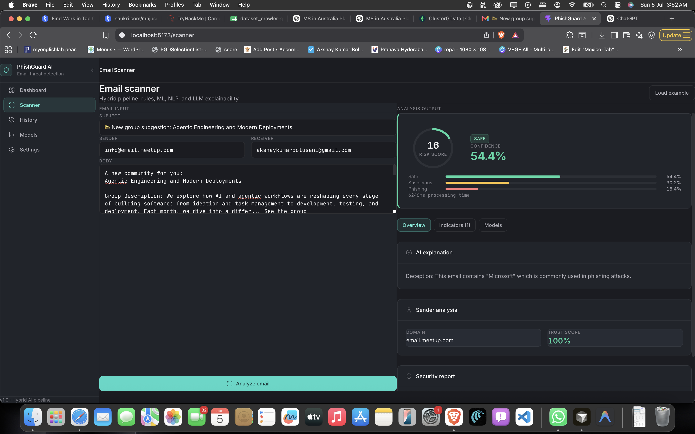
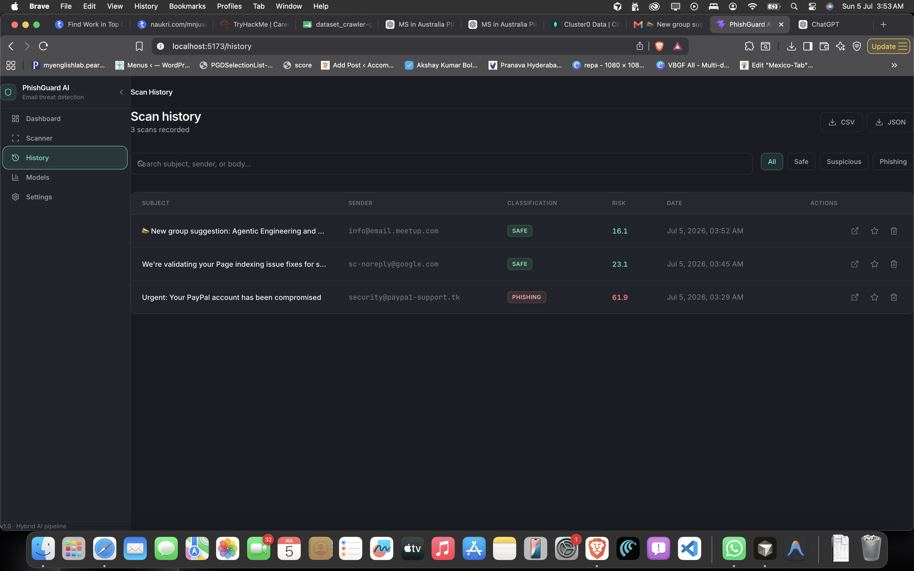
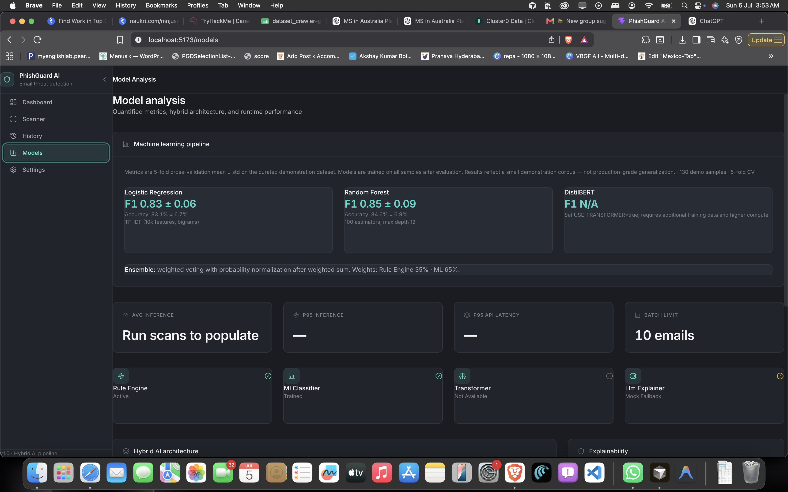
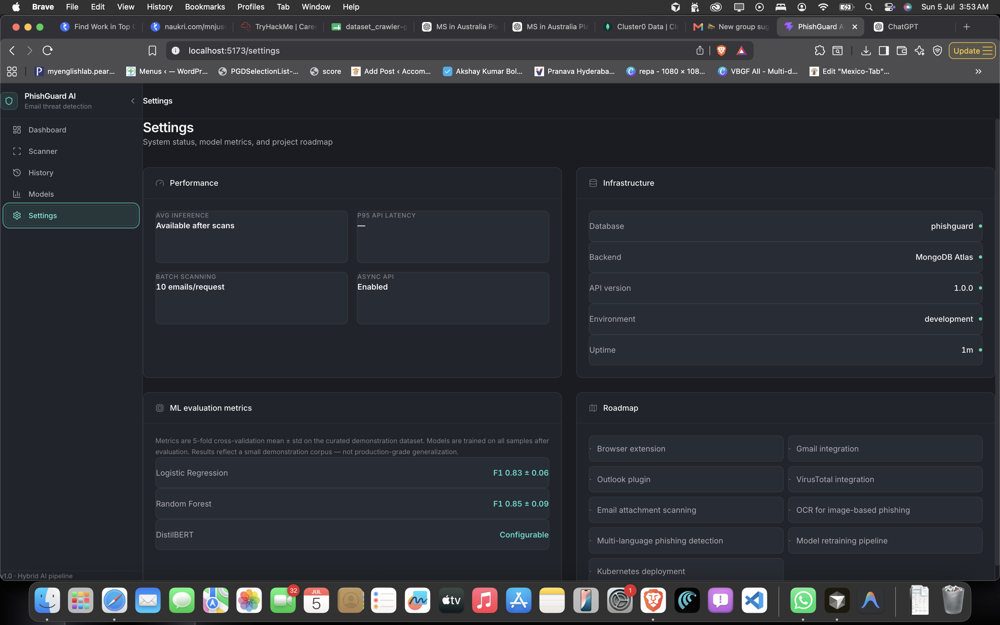
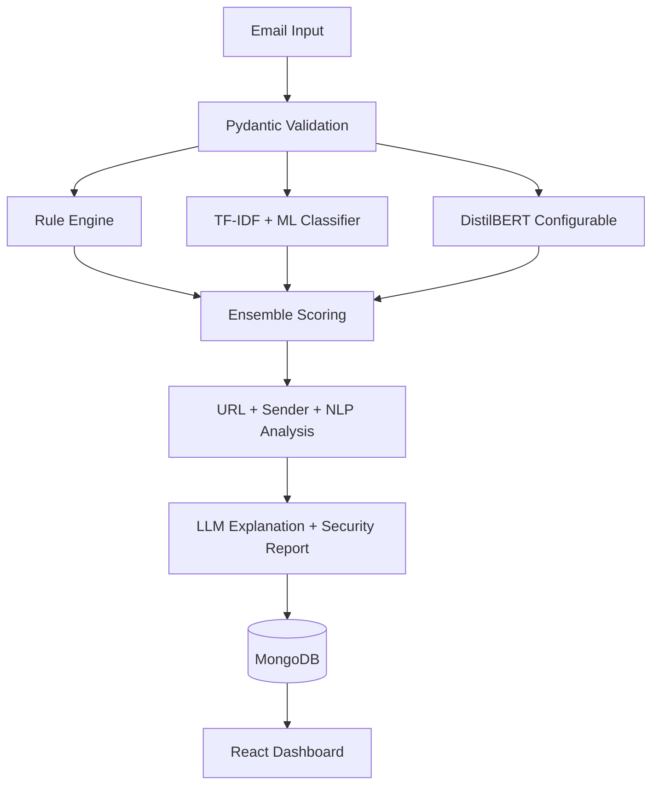

# PhishGuard AI

[](https://www.python.org/)
[](LICENSE)
[](https://fastapi.tiangolo.com/)
[](https://react.dev/)
[](https://www.mongodb.com/atlas)
[](https://www.docker.com/)
[](.github/workflows/ci.yml)
[](.github/workflows/ci.yml)
[](.github/workflows/ci.yml)
[](.github/workflows/ci.yml)

**PhishGuard AI** is a full-stack phishing email detection platform that combines rule-based detection, classical ML, NLP, and LLM explainability into an **interpretable analysis platform** inspired by SOC workflows.

The emphasis is **software architecture and explainable AI** — not maximizing benchmark accuracy on a large proprietary phishing corpus.

---

## At a Glance

| | |
|---|---|
| **Stack** | FastAPI · React · MongoDB · Docker · scikit-learn · spaCy |
| **UI** | 6 pages — Dashboard, Scanner, History, Report, Models, Settings |
| **API** | 17 mounted endpoints under `/api/v1` |
| **AI layers** | Rules (29) · TF-IDF ML · configurable DistilBERT · LLM reports |
| **Focus** | Explainable triage, not binary spam labels |

---

## Key Takeaway

PhishGuard shows how **deterministic heuristics**, **classical ML**, **transformer NLP**, and **LLM reasoning** fit into one **explainable, production-inspired workflow** for phishing analysis.

---

## Screenshots

Real UI from a local run — hybrid scan pipeline, MongoDB-backed history, and CV metrics on the [demonstration dataset](#dataset).

### Dashboard
Threat overview with trend charts, classification breakdown, and KPI cards.



### Email Scanner
Split-pane analyzer with risk score, probability breakdown, AI explanation, and sender trust.



### Scan History
Searchable history with classification filters and CSV/JSON export.



### Model Analysis
Cross-validated ML metrics, ensemble weights, and runtime engine status.



### Settings
Infrastructure health, ML evaluation metrics, and roadmap.



---

## What Makes This Different?

Unlike detectors that return only a label, every PhishGuard prediction includes **evidence**: URL intelligence, sender reputation, NLP indicators, per-model confidence, analyst-style security reports, and exportable scan history.

---

## Threat Model

**Designed to detect:** credential harvesting · BEC · brand impersonation · malicious URLs · social engineering

**Not in scope:** attachment execution · malware sandboxing · real-time mail gateway filtering

PhishGuard is an **analysis and triage platform** — users submit email content; it is not an inline mail filter.

---

## Dataset

> **Canonical statement:** A curated **130-email demonstration dataset** (50 safe · 35 suspicious · 45 phishing) used for **pipeline validation and architecture testing** — not a production-trained model.

All ML metrics in this README refer to this dataset. Cross-validation mean ± std is reported to surface variance on limited data.

---

## Architecture Overview

- **Separation of concerns** — API, services, repositories, and AI pipeline are independently testable
- **Repository + service layers** — MongoDB access decoupled from routes and business logic
- **Designed for horizontal scalability** — stateless REST inference without session affinity; persistence in MongoDB (not load-tested in this build)
- **Modular AI pipeline** — rules, ML, transformer, and LLM compose via weighted ensemble
- **Explainable by default** — indicators, URLs, sender trust, and LLM reports on every scan
- **Container-first** — Docker Compose for reproducible runs

**GitHub topics:** `fastapi` · `python` · `react` · `mongodb` · `docker` · `machine-learning` · `nlp` · `cybersecurity` · `llm` · `transformers` · `scikit-learn` · `phishing` · `security`

---

## Technical Reference

*Sections below are for reviewers who want implementation detail.*

### Features

**Detection:** hybrid ensemble · 29 regex rules · URL/sender/NLP analysis · risk score · batch scan (10/request) · per-model latency comparison

**Security report (every scan):** executive summary · classification + confidence · indicators with evidence · URL/sender findings · attack type · AI explanation · recommended actions · processing time

**Web app:** threat dashboard · split-pane scanner · searchable history with CSV/JSON export · full report view · model metrics · settings/health

No login — anonymous workspace for demonstration use.

**Platform:** MongoDB persistence · runtime metrics API · feedback endpoint · rate limiting · structlog · Docker · GitHub Actions CI · pytest

### Hybrid AI Pipeline



| Layer | Role | Typical Latency |
|-------|------|-----------------|
| Rule Engine | 29 regex rules across phishing categories | ~5 ms |
| ML Classifier | TF-IDF + LR + Random Forest ensemble | ~50 ms |
| Transformer | DistilBERT (configurable) | ~500 ms |
| LLM Explainer | Analyst-style report generation | ~2 s |

### Machine Learning

5-fold stratified CV on the [demonstration dataset](#dataset). Retrain: `cd backend && python -m app.ai.models.train`

| Model | F1 (weighted) | Accuracy |
|-------|---------------|----------|
| Logistic Regression | **0.83 ± 0.06** | 83.1% ± 6.7% |
| Random Forest | **0.85 ± 0.09** | 84.6% ± 6.9% |
| DistilBERT | N/A | Configurable via `USE_TRANSFORMER=true` |

**Ensemble weights:** Rule 35% + ML 65% (without transformer); 25/35/40 when DistilBERT is active.

### API Reference

**17 endpoints** under `/api/v1` — scan ×5 · history ×2 · dashboard ×3 · health/models/feedback ×7. Auth routes exist in code but are **not mounted**.

Docs: [localhost:8000/docs](http://localhost:8000/docs) · [docs/API.md](docs/API.md)

<details>
<summary>Endpoint list</summary>

| Method | Endpoint | Description |
|--------|----------|-------------|
| `POST` | `/api/v1/scan` | Analyze single email |
| `POST` | `/api/v1/scan/batch` | Batch analyze (≤10) |
| `GET` | `/api/v1/scan/{id}` | Get scan by ID |
| `DELETE` | `/api/v1/scan/{id}` | Delete scan |
| `POST` | `/api/v1/scan/{id}/favorite` | Toggle favorite |
| `GET` | `/api/v1/history` | Paginated history |
| `GET` | `/api/v1/history/export` | CSV/JSON export |
| `GET` | `/api/v1/dashboard/statistics` | Dashboard stats |
| `GET` | `/api/v1/dashboard/trends` | Threat trends |
| `GET` | `/api/v1/dashboard/attack-types` | Attack categories |
| `GET` | `/api/v1/health` | Health check |
| `GET` | `/api/v1/metrics` | Runtime latency |
| `GET` | `/api/v1/models/status` | Engine status |
| `GET` | `/api/v1/models/info` | Architecture + metrics |
| `GET` | `/api/v1/models/metrics` | Persisted CV metrics |
| `POST` | `/api/v1/feedback` | Submit feedback |
| `GET` | `/api/v1/feedback` | List feedback |

</details>

<details>
<summary>Example scan request / response</summary>

```http
POST /api/v1/scan
Content-Type: application/json

{
  "subject": "Verify your Microsoft account",
  "sender": "support@microsoft-security-login.com",
  "receiver": "user@example.com",
  "body": "Your account will be suspended unless you verify within 24 hours..."
}
```

Returns: classification, confidence, risk score, indicators, URL/sender analysis, NLP features, security report, model breakdown, `processing_time_ms`.

</details>

### Runtime Metrics

Live inference and API latency via `/api/v1/metrics` — populated after real scans, not hard-coded.

### Limitations

- ML models trained on the [demonstration dataset](#dataset) only
- No VirusTotal / OpenPhish integration by default
- Transformer and LLM layers optional; template fallback when LLM unavailable
- No auth in current build; no load-test or production deployment evidence yet

### Project Statistics

| Metric | Value |
|--------|-------|
| REST API endpoints | 17 under `/api/v1` |
| React pages | 6 |
| Detection rules | 29 |
| AI engines | 4 |
| Testing | pytest + GitHub Actions (flake8, mypy, frontend build) |

---

## Getting Started

```bash
# Backend
cd backend && python -m venv .venv && source .venv/bin/activate
pip install -e ".[dev]"
cp ../.env.example ../.env   # set MONGODB_URL
uvicorn app.main:app --reload

# Frontend
cd frontend && npm install && npm run dev

# Docker
docker compose up --build
```

| Service | URL |
|---------|-----|
| App | http://localhost:5173 |
| API docs | http://localhost:8000/docs |
| Docker frontend | http://localhost:8080 |

```bash
cd backend && pytest --cov=app tests/
```

---

## Roadmap

Browser extension · Gmail/Outlook plugins · VirusTotal · attachment scanning · OCR · multi-language · retraining pipeline · Kubernetes

---

## Documentation

- [Architecture](docs/ARCHITECTURE.md)
- [API Reference](docs/API.md)

---

## License

MIT — see [LICENSE](LICENSE).
