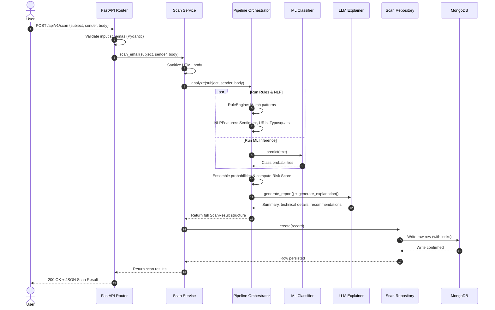

# System Architecture Design

This document details the system design, data flow, and components of PhishGuard AI.

## Architectural Overview

PhishGuard AI follows a **Clean Architecture** model using a modular, decoupled structure. The system is split into distinct layers with unidirectional dependencies flowing inward:

```
[ Frontend Client ] ──(HTTP/JSON)──> [ API Layer (FastAPI Controllers) ]
                                             │
                                             ▼
                                     [ Service Layer ]
                                             │
                       ┌─────────────────────┴─────────────────────┐
                       ▼                                           ▼
             [ AI Pipeline Engine ]                    [ Repository Layer ]
            (Hybrid Analysis Logic)                     (CRUD Abstract Interface)
                       │                                           │
                       ▼                                           ▼
         [ Models / NLP / Analyzers ]                     [ MongoDB Atlas ]
         (Rule, ML, NLP, URL, Sender)                     (Indexed collections)
```

### 1. API Layer (`app.api`)
- Handles HTTP requests, parses schemas, validates inputs using Pydantic, and returns JSON.
- Injects services using FastAPI Dependency Injection.
- Applies cross-cutting middleware: logging, custom app exceptions, security headers, and rate-limiting.

### 2. Service Layer (`app.services`)
- Contains domain logic. Coordinates database storage and AI processing.
- Orchestrates multi-step scenarios like scanning an email, updating logs, and generating feedback metrics.

### 3. Repository Layer (`app.repositories`)
- Implements the Data Access Object (DAO) pattern.
- Interfaces with MongoDB via PyMongo to query, insert, update, or delete documents.
- Provides a clean abstract interface through the repository pattern. Collections: `users`, `scans`, `feedback`, `api_keys`.

### 4. Database Layer (`app.database`)
- Manages MongoDB connection pooling, health checks, and index creation on startup.
- Uses indexed queries and aggregation pipelines for dashboard statistics.

### 5. AI Pipeline Engine (`app.ai`)
- Orchestrates four sequential analysis layers:
  - **RuleEngine**: Regex parsing of key terms.
  - **MLClassifier**: Vectorizer and classical ensemble models (Random Forest, Logistic Regression).
  - **Transformer**: Sequence classifier.
  - **LLMExplainer**: Report generator with customizable mock generation for offline usage.
- Sub-components handle targeted analytics:
  - **URLAnalyzer**: Detects homograph/typosquat attacks, shortened URLs, and HTTP mismatches.
  - **SenderAnalyzer**: Inspects display name mismatches, free domains, and domain typosquats.
  - **NLPFeatureExtractor**: Computes readability indices, sentiment scores, and extracts Named Entities (NER) using spaCy.

---

## Detailed Data Flow

### Email Analysis Sequence



---

## Security & Resiliency Designs

- **JWT/API Key Auth**: Routes require either a valid Bearer JWT token or a securely hashed developer API key.
- **Connection Pooling**: MongoDB connections are pooled via PyMongo with configurable `MONGODB_MAX_POOL_SIZE`.
- **Indexes**: Unique indexes on user email/username and scan IDs; compound indexes for history queries.
- **Fail-Soft Models**: If deep learning libraries (PyTorch/Transformers) are absent or fail, the platform downgrades to rule-based heuristics and classical ML classifiers. Similarly, if OpenAI/LLM endpoints are unreachable, it switches to a template-driven, rule-based report generator.
